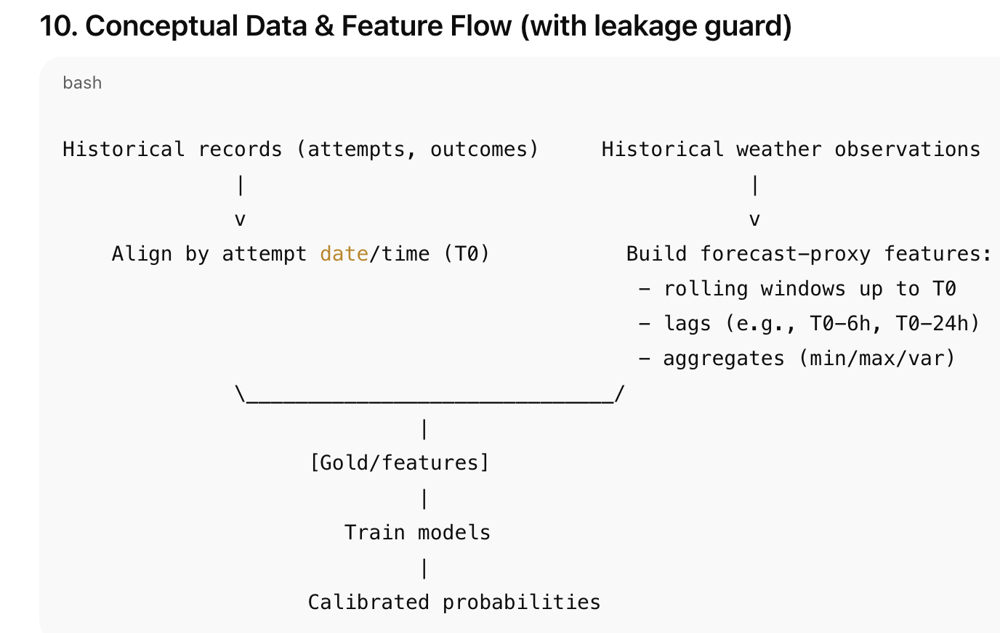

# Data-Mining-Assignment-1
ChatGPT: [Link Text](https://github.com/darshlukkad/Data-Mining-1/blob/main/CRISM_DM_Assignment_1_DM.pdf)

Kaggle: https://www.kaggle.com/datasets/codersree/mount-rainier-weather-and-climbing-data

# Visual Insights

## DM_1.png

## DM_2.png

## DM_3.png

## DM_4.png

## DM_5.png

## DM_6.png

## DM_7.png

## DM_8.png

## DM_9.png

## DM_10.png

## DM_11.png

## DM_12.png

## DM_13.png

## DM_14.png

